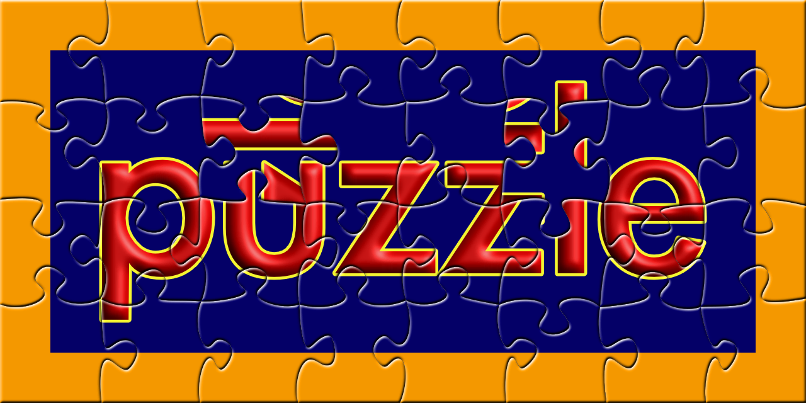
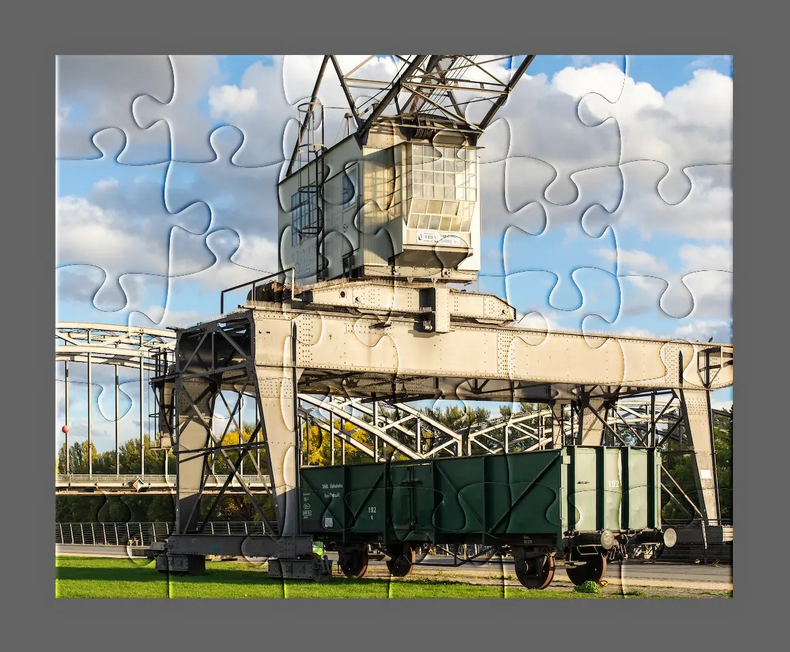
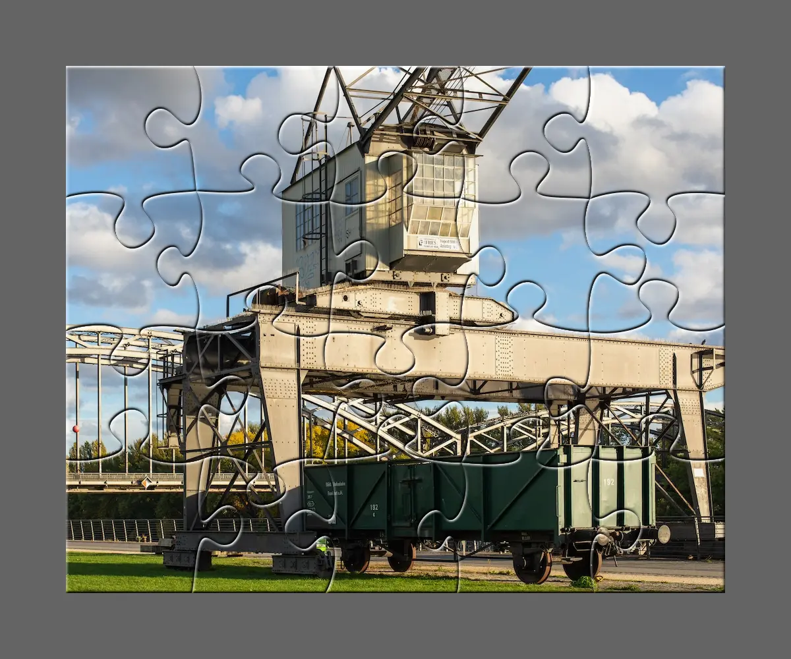
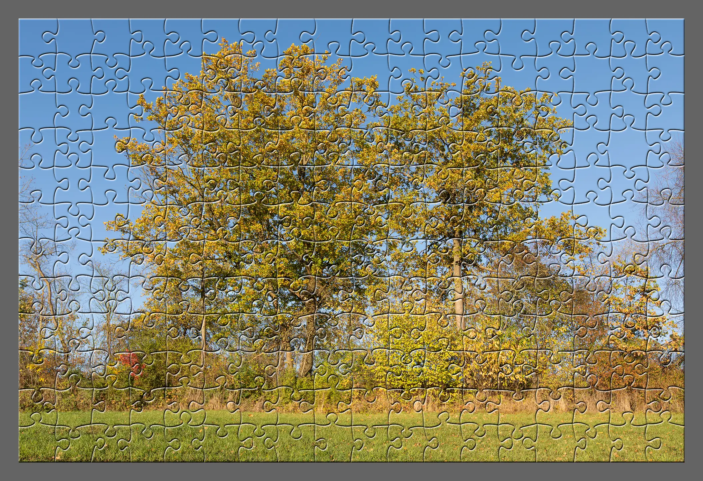
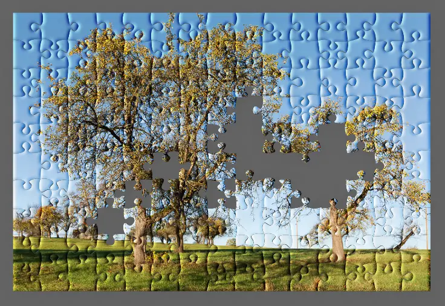

# Make a Puzzle

<div align="center">

</div>
<br/>

This tool makes a puzzle from a photo, lets you rebuild a new image from all or a selection of pieces, and can create a simple building animation. You can adjust an script [bevel.zsh](./bevel.zsh) to give the puzzle pieces a realistic 3D bevel effect. Perfect for fun.

# Setup

Note for Windows users: this project uses `zsh` and UNIX-specific tools. Native execution on Windows is not supported. Please use the provided Docker setup instead.

## Setup for Running Natively

For native execution, it is recommended to use `pyenv` to manage your Python environment. This avoids conflicts with the system Python and ensures consistent versions across systems.

For `pyenv` based setup on Linux or macOS run the commands in a `bash` shell:

### Pyenv and Python

pyenv

    curl https://pyenv.run | bash
    export PATH="$HOME/.pyenv/bin:$PATH"
    eval "$(pyenv init --path)"
    eval "$(pyenv init -)"
    exec "$SHELL"

Python 3.13 and Requirements

    pyenv install 3.13.7
    cd <puzzle dir>
    pyenv local 3.13.7
    python -m venv .venv
    source .venv/bin/activate
    pip install -r requirements.txt

### Zsh

Required with options `--pz` and `-an`

    zsh --version
    zsh 5.9 (x86_64-apple-darwin23.0)

### Others

Required with animation (option `-an`) and assembling the puzzle (option `--pz`)

#### Imagemagick®

[See Reference ImageMagick®](#imagemagick)

#### WebP `cwebp` `webpmux`

[See Reference WebP](#webp)

#### APNG `apngasm`

[See Reference APNG](#apng)

#### Recommended Versions

The script has been tested with the following versions.

```bash
command -v convert && convert --version
# Version: ImageMagick 7.1.1-43 Q16 x86_64 22550 https://imagemagick.org

command -v webpmux && webpmux -version
# 1.5.0

command -v apngasm && apngasm --version
# APNG Assembler v3.1.10 (frontend v3.1.10)
```

> **Note:** Installing `apngasm` via
>
> ```bash
> sudo apt install apngasm
> ```
>
> may install an outdated version (e.g., **2.91-5+b1**) that does not work with this script.
> See [Reference APNG](#apng) for instructions to build version 3.1.10 or newer from source.

## Setup for Running in Docker

Docker version >=26.0.0

# Run

The entire output is saved in a temporary folder like `tmp_20231106132717`.

Output is:
- all the puzzle pieces `img_puzzle_<nr>.png` (optional) 
- all the puzzle pieces with bevel effect `img_puzzle_<nr>_bevel.png` (optional)
- all the puzzle piece masks `puzzle_<nr>.png`
- the assembled photo and animation `done_puzzle.png` (optional)
- the animation `done_puzzle.webp.png` or `done_puzzle.apng.png` (all optional)

## Usage

Command

    python PlayPuzzle.py --help

Output

    usage: PlayPuzzle [-h] [-v] [-f <fmt>] [-c <farbe>] [--by-type-subdirs] [--swap-twins] [--animate <fmt>] [--photo <file>] [--width <int>]
                    [--height <int>] [--dpi <int>] [--pz <0-100>] [--equal-pairs <int>] [--seed <int>] [--minparts <int>] [--maxparts <int>]

    PlayPuzzle – Generator und Renderer

    options:
    -h, --help           show this help message and exit
    -v, --version        show program's version number and exit

    Ausgabe:
    -f, --format <fmt>   Ausgabeformat (default: png)
    -c, --color <farbe>  Füllfarbe (z. B. "k" = schwarz) (default: k)
    --by-type-subdirs    Puzzleteile in Typsubordnern speichern (default: False)
    --swap-twins         Paarweise identisch geformte Teile beim Zusammenbau tauschen (default: False)

    Animation:
    --animate <fmt>      Puzzle-Animation mit angegebenem Format erzeugen (default: None)

    Foto/Render:
    --photo <file>       Pfad zur Fotodatei (default: None)
    --width <int>        Foto-Breite in Pixel (default: None)
    --height <int>       Foto-Höhe in Pixel (default: None)
    --dpi <int>          Foto-DPI (default: 100.0)

    Puzzle-Logik:
    --pz <0-100>         Neues Foto mit Anteil der Puzzleteile (0..100) (default: 0)
    --equal-pairs <int>  Versuch, paarweise identische Formen zu erzeugen (default: 0)
    --seed <int>         Initialer Zufalls-Seed (default: 92)

    Teile-Grenzen:
    --minparts <int>     Minimale Teilezahl (≥2, ≤4950) (default: None)
    --maxparts <int>     Maximale Teilezahl (≥2, ≤4950) (default: None)

    Beispiel: Baue aus dem Bild ein Puzzle mit 30 bis 40 Teilen und erstelle ein neues Bild aus 60% der Teile. Der Wert für 'seed' bestimmt die zufällige Anordnung.
    
    python PlayPuzzle.py --minparts 30 --maxparts 40 --seed 35 --photo photoA.jpg --pz 60

    docker run -it -v .:/app --rm puzzle --minparts 30 --maxparts 40 --seed 35 --photo photoA.jpg --pz 60


## Using with Docker

To use this application with Docker, follow these instructions:

### Building the Docker Image

To build the Docker image, run the following command in the directory containing the Dockerfile:

    docker buildx build --tag puzzle .

This command builds a Docker image named puzzle.

### Running the Application in Docker

To run the application using Docker, you can mount the current directory to the `/app` directory in the container. This allows the container to access and write files to your host directory. Use the following command to run the application:

    docker run -it -v .:/app --rm puzzle --help

This command runs the puzzle Docker container, showing the help information as it would when running the application natively. Any command line arguments applicable to `PlayPuzzle.py` can be used after the image name.

## Version

Command

    python PlayPuzzle.py --version

Output

    PlayPuzzle v1.0.4
    PuzzleBoard v1.1.8

## Example A

A puzzle with >= 45 pieces and with animation:

    python PlayPuzzle.py --photo Landschaft.jpg --minparts 45 --pz 100 --animate apng

    Puzzle piece width-to-height ratio: 1.0818120351588911
    Make a puzzle with 54 (9x6) parts!
    Play puzzle

<div align="center">
<br/>

<div align="center">
    Photo: 800 x 493 Pixel ( <code>cwebp -near_lossless 70</code> )
</div>
</div>
<div align="center">
<br/>

<div align="center">
    Photo: 800 x 493 Pixel. APNG Animation.
</div>
</div>

### Example A with Docker

Run the following command in the directory containing the Dockerfile:

    docker run -it -v .:/app --rm puzzle --photo Landschaft.jpg --minparts 45 --pz 100 --animate apng

## Example B

A minimal puzzle with four pieces and variation of the `seed` value:

Command

    python PlayPuzzle.py --minparts 4 --photo PuzzleMitVierTeilen.png --pz 100

other `seed` value:

    python PlayPuzzle.py --minparts 4 --photo PuzzleMitVierTeilen.png --pz 100 --seed 31

Output

    Puzzle piece width-to-height ratio: 1.0
    Make a puzzle with 4 (4x1) parts!
    Play puzzle

<div align="center">
<br/>

<div align="center">
    Photo: 800 x 200 Pixel ( <code>cwebp -near_lossless 70</code> )
</div>
<br/>

<div align="center">
    Photo: 800 x 200 Pixel, seed=31 ( <code>cwebp -near_lossless 70</code> )
</div>
</div>

### Example B with Docker

Run the following command in the directory containing the Dockerfile:

    docker run -it -v .:/app --rm puzzle --minparts 4 --photo PuzzleMitVierTeilen.png --pz 100

## Example C

A puzzle with >= 25 pieces, only 70% complete:

Command

    python PlayPuzzle.py --minparts 25 --photo QuadratRotMitZahlen.jpg --pz 70

Output

    Puzzle piece width-to-height ratio: 1.0
    Make a puzzle with 25 (5x5) parts!
    Play puzzle

<div align="center">
<br/>

<div align="center">
    Photo: 1000 x 1000 Pixel ( <code>cwebp -near_lossless 70</code> )
</div>
</div>

### Example C with Docker

Run the following command in the directory containing the Dockerfile:

    docker run -it -v .:/app --rm puzzle --minparts 25 --photo QuadratRotMitZahlen.jpg --pz 70

## Example D

A puzzle with >= 64 pieces and, if possible, 10 pairs of pieces with the same shape. The pieces with the same shape should be swapped:

Command

    python PlayPuzzle.py --minparts 64 --photo QuadratBuntMitZahlen.jpg --equal-pairs 10 --swap-twins --pz 100

Ouput

    Puzzle piece width-to-height ratio: 1.0
    Make a puzzle with 64 (8x8) parts!
    Equal puzzle pieces=[(1, 39), (5, 24), (3, 57), (18, 28), (34, 44)]
    Play puzzle


<div align="center">
<br/>

<div align="center">
    Photo: 1000 x 1000 Pixel ( <code>cwebp -near_lossless 70</code> )
</div>
</div>

### Example D with Docker

Run the following command in the directory containing the Dockerfile:

    docker run -it -v .:/app --rm puzzle --minparts 64 --photo QuadratBuntMitZahlen.jpg --equal-pairs 10 --swap-twins --pz 100


# References

## ImageMagick

- https://imagemagick.org

### ImageMagick - Bevel

- https://usage.imagemagick.org/transform/#shade_blur

## Affinity Photo

- https://affinity.serif.com

## Webp

- https://developers.google.com/speed/webp/docs/cwebp

- https://developers.google.com/speed/webp/docs/webpmux

## APNG

- https://github.com/apngasm/apngasm

## OpenCV

- https://opencv.org
