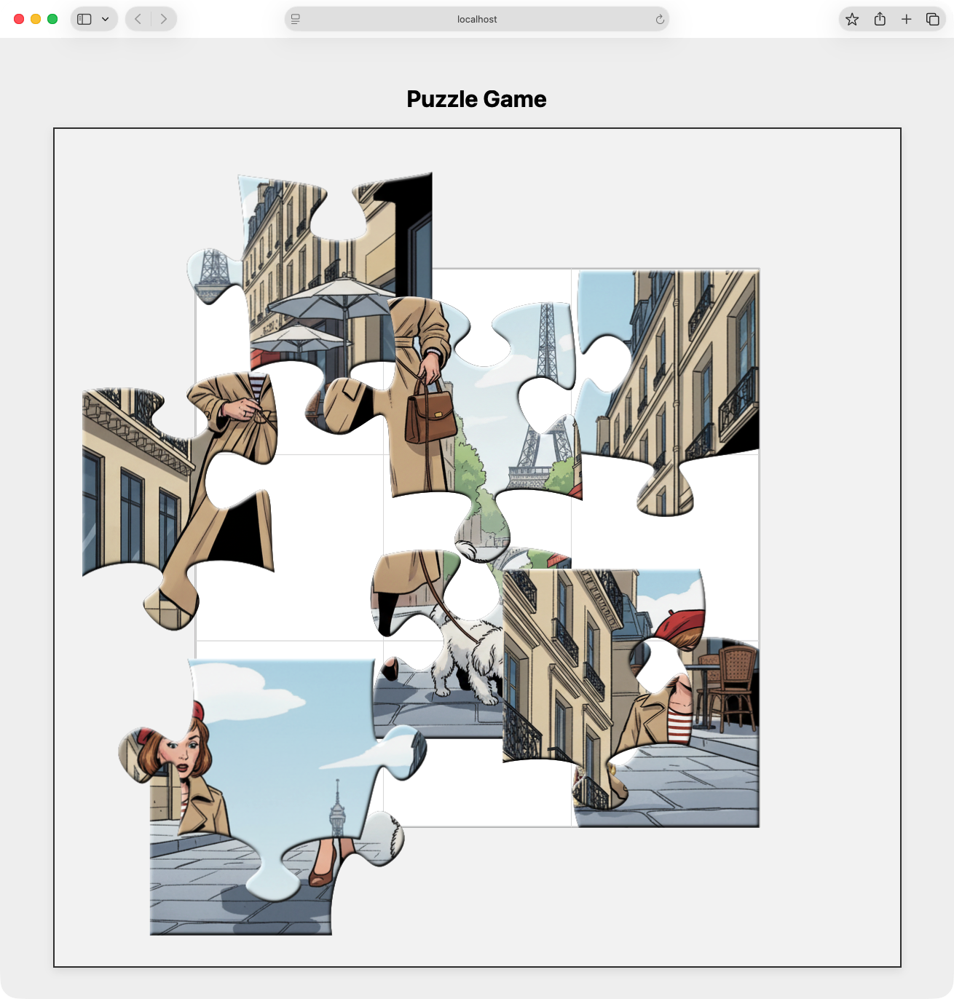

# Ein Puzzle erstellen

<div align="center">

</div>
<br/>

Das Tool erstellt aus einem Foto ein Puzzle. Es baut ein neues Bild aus allen oder ausgewählten Teilen zusammen. Es kann auch eine Animation vom Aufbau erstellen. Das Skript [bevel.zsh](./bevel.zsh) fügt den Puzzleteilen einen 3D-Effekt hinzu.

# Einrichtung

Hinweis für Windows: Das Projekt nutzt `zsh` und UNIX-Tools. Es läuft nicht direkt unter Windows. Unter Windows kann das Docker-Setup genutzt werden.

## Einrichtung für lokalen Start (Linux/macOS)

Für den lokalen Start am besten `pyenv` nutzen. Das verwaltet die Python-Umgebung. So gibt es keine Konflikte mit dem System-Python.

### Pyenv und Python

Installation von pyenv:

```bash
curl https://pyenv.run | bash
export PATH="$HOME/.pyenv/bin:$PATH"
eval "$(pyenv init --path)"
eval "$(pyenv init -)"
exec "$SHELL"
```
Python 3.13 und Abhängigkeiten installieren:
```bash
pyenv install 3.13.7
cd <puzzle dir>
pyenv local 3.13.7
python -m venv .venv
source .venv/bin/activate
pip install -r requirements.txt
```
### Zsh prüfen
```bash
zsh --version
```
```text
zsh 5.9 (x86_64-apple-darwin23.0)
```
### Weitere Anforderungen

Notwendig für Animationen (Option `--animate`) und Puzzle-Zusammenbau (Option `--pz`).

#### Imagemagick®

[Siehe Referenz ImageMagick®](#imagemagick)

#### WebP `cwebp` `webpmux`

[Siehe Referenz WebP](#webp)

#### APNG `apngasm`

[Siehe Referenz APNG](#apng)

#### Empfohlene Versionen

Das Skript wurde mit diesen Versionen getestet:

```bash
command -v convert && convert --version
```
```text
# Version: ImageMagick 7.1.1-43 Q16 x86_64 22550 [https://imagemagick.org](https://imagemagick.org)
```
```bash
command -v webpmux && webpmux -version
```
```text
# 1.5.0
```
```bash
command -v apngasm && apngasm --version
```
```text
# APNG Assembler v3.1.10 (frontend v3.1.10)
```

> **Hinweis:** Die Installation von `apngasm` über
> ```bash
> sudo apt install apngasm
> ```
> liefert oft eine veraltete Version (z.B. **2.91-5+b1**). Diese funktioniert nicht mit diesem Skript.
> Siehe Referenz APNG für eine Anleitung zum Selbstbauen von Version 3.1.10 oder neuer.

## Einrichtung für Docker

Benötigte Docker-Version: >=26.0.0

# Ausführen

Das Programm speichert die gesamte Ausgabe in einem temporären Ordner (z.B. `tmp_20231106132717`).

Ausgabe-Dateien:

* Puzzleteile `img_puzzle_<nr>.png` (optional)
* Puzzleteile mit 3D-Effekt `img_puzzle_<nr>_bevel.png` (optional)
* Masken für Puzzleteile `puzzle_<nr>.png`
* Zusammengesetztes Foto und Animation `done_puzzle.png` (optional)
* Animation `done_puzzle.webp.png` oder `done_puzzle.apng.png` (optional)

## Syntax

```bash
python PlayPuzzle.py --help
```

```text
usage: PlayPuzzle [-h] [-v] [-f <fmt>] [-c <farbe>] [--by-type-subdirs] [--swap-twins] [--game] [--animate <fmt>] [--photo <file>] [--width <int>]
                [--height <int>] [--dpi <int>] [--pz <0-100>] [--equal-pairs <int>] [--seed <int>] [--minparts <int>] [--maxparts <int>]

PlayPuzzle – Generator und Renderer

options:
-h, --help           show this help message and exit
-v, --version        show program's version number and exit

Ausgabe:
-f, --format <fmt>   Ausgabeformat (default: png)
-c, --color <farbe>  Füllfarbe (z. B. "k" = schwarz) (default: k)
--by-type-subdirs    Puzzleteile in Typsubordnern speichern (default: False)
--swap-twins         Paarweise identisch geformte Teile beim Zusammenbau tauschen (default: False)
--game               Öffne das Puzzle zum Spielen im Browser (default: False)

Animation:
--animate <fmt>      Puzzle-Animation mit angegebenem Format erzeugen (default: None)

Foto/Render:
--photo <file>       Pfad zur Fotodatei (default: None)
--width <int>        Foto-Breite in Pixel (default: None)
--height <int>       Foto-Höhe in Pixel (default: None)
--dpi <int>          Foto-DPI (default: 100.0)

Puzzle-Logik:
--pz <0-100>         Neues Foto mit Anteil der Puzzleteile (0..100) (default: 0)
--equal-pairs <int>  Versuch, paarweise identische Formen zu erzeugen (default: 0)
--seed <int>         Initialer Zufalls-Seed (default: 92)

Teile-Grenzen:
--minparts <int>     Minimale Teilezahl (≥2, ≤4950) (default: None)
--maxparts <int>     Maximale Teilezahl (≥2, ≤4950) (default: None)

Beispiel: Baue aus dem Bild ein Puzzle mit 30 bis 40 Teilen und erstelle ein neues Bild mit 60 % der Teile. Der Wert für 'seed' bestimmt die zufällige Anordnung.

python PlayPuzzle.py --minparts 30 --maxparts 40 --seed 35 --photo photoA.jpg --pz 60

docker run -it -v .:/app --rm puzzle --minparts 30 --maxparts 40 --seed 35 --photo photoA.jpg --pz 60
```

## Verwendung mit Docker

Anleitung für Docker:

### Docker Image bauen

Im Verzeichnis mit `Dockerfile`::

```bash
docker buildx build --tag puzzle .
```

Erstellt ein Docker Image mit Namen `puzzle`.

### Anwendung in Docker starten

Den aktuellen Ordner im Container unter `/app` einbinden. So kann der Container Dateien lesen und schreiben. Befehl zum Starten:

```bash
docker run -it -v .:/app --rm puzzle --help
```

Das startet den Puzzle-Container und zeigt die Hilfe an. Alle Argumente für `PlayPuzzle.py` funktionieren auf die selbe Weise.

## Version

```bash
python PlayPuzzle.py --version
```
```text
PlayPuzzle v1.0.5
PuzzleBoard v1.1.8
```

## Beispiel A

Das Puzzle im Browser spielen:

```bash
python PlayPuzzle.py --minparts 7 --photo NativeAmericanTribesman.jpg --pz 100 --game 
```

<div align="center">

<div align="center">
Browserfenster mit Puzzle-Spiel
</div>
</div>

## Beispiel B

Ein kleines Puzzle mit vier Teilen. Variation vom `seed` Wert:

```bash
python PlayPuzzle.py --minparts 4 --photo PuzzleMitVierTeilen.png --pz 100
```

Anderer `seed` Wert:

```bash
python PlayPuzzle.py --minparts 4 --photo PuzzleMitVierTeilen.png --pz 100 --seed 31
```

```text
Puzzle piece width-to-height ratio: 1.0
Make a puzzle with 4 (4x1) parts!
Play puzzle
```

<div align="center">

<div align="center">
Foto: 800 x 200 Pixel ( <code>cwebp -near_lossless 70</code> )
</div>

<div align="center">
Foto: 800 x 200 Pixel, seed=31 ( <code>cwebp -near_lossless 70</code> )
</div>
</div>

### Beispiel B mit Docker

Im Verzeichnis mit `Dockerfile`:

```bash
docker run -it -v .:/app --rm puzzle --minparts 4 --photo PuzzleMitVierTeilen.png --pz 100
```

## Beispiel C

Ein Puzzle mit >= 25 Teilen. Nur zu 70% fertiggestellt:

```bash
python PlayPuzzle.py --minparts 25 --photo QuadratRotMitZahlen.jpg --pz 70
```
```text
Puzzle piece width-to-height ratio: 1.0
Make a puzzle with 25 (5x5) parts!
Play puzzle
```

<div align="center">

<div align="center">
Foto: 1000 x 1000 Pixel ( <code>cwebp -near_lossless 70</code> )
</div>
</div>

### Beispiel C mit Docker

Im Verzeichnis mit `Dockerfile`:

```bash
docker run -it -v .:/app --rm puzzle --minparts 25 --photo QuadratRotMitZahlen.jpg --pz 70
```

## Beispiel D

Ein Puzzle mit >= 64 Teilen. Wenn möglich 10 Paare mit gleicher Form erzeugen und die Paarteile vertauschen:

```bash
python PlayPuzzle.py --minparts 64 --photo QuadratBuntMitZahlen.jpg --equal-pairs 10 --swap-twins --pz 100
```
```text
Puzzle piece width-to-height ratio: 1.0
Make a puzzle with 64 (8x8) parts!
Equal puzzle pieces=[(1, 39), (5, 24), (3, 57), (18, 28), (34, 44)]
Play puzzle
```

<div align="center">

<div align="center">
Foto: 1000 x 1000 Pixel ( <code>cwebp -near_lossless 70</code> )
</div>
</div>

### Beispiel D mit Docker

Im Verzeichnis mit `Dockerfile`:

```bash
docker run -it -v .:/app --rm puzzle --minparts 64 --photo QuadratBuntMitZahlen.jpg --equal-pairs 10 --swap-twins --pz 100
```

## Beispiel E

Ein Puzzle mit >= 45 Teilen und Animation:

```bash
python PlayPuzzle.py --photo Landschaft.jpg --minparts 45 --pz 100 --animate apng
```
```text
Puzzle piece width-to-height ratio: 1.0818120351588911
Make a puzzle with 54 (9x6) parts!
Play puzzle
```

<div align="center">

<div align="center">
Foto: 800 x 493 Pixel ( <code>cwebp -near_lossless 70</code> )
</div>
</div>
<div align="center">

<div align="center">
Foto: 800 x 493 Pixel. APNG Animation.
</div>
</div>

# Ausführen in VSCode

Starten und Debuggen funktionieren direkt in Visual Studio Code. Eine `launch.json` und `settings.json` liegt schon bereit.

## Voraussetzungen

Zuerst die lokale Python-Umgebung einrichten. Das Projekt sucht Abhängigkeiten im lokalen Ordner `.venv`. Siehe *Pyenv und Python*.

## VSCode einrichten

1. Den *ganzen* Projektordner in VSCode öffnen (`File > Open Folder...`).
2. Die offizielle **Python Erweiterung** von Microsoft installieren. Im Reiter "Extensions" (Strg+Shift+X) nach `ms-python.python` suchen.

## Starten und Debuggen

Das Projekt ist "ready to debug". Die Datei `.vscode/settings.json` weist VSCode den Python-Interpreter aus dem Ordner `.venv` zu.

1. Ansicht **Run and Debug** in der linken Leiste öffnen (Symbol mit Play-Button und Käfer 🐞).
2. Oben ist ein **grüner Play-Button** und ein Auswahlmenü.
3. Das Menü enthält alle Debug-Ziele aus der Datei `.vscode/launch.json`.
4. Ziel auswählen (z.B. "Example A - Landschaft").
5. Grünen Play-Button drücken (oder `F5`) zum Starten.

Jetzt Haltepunkte setzen, Variablen prüfen und den Debugger nutzen.

# Referenzen

## ImageMagick

* https://imagemagick.org

### ImageMagick - Bevel

* https://usage.imagemagick.org/transform/#shade_blur

## Webp

* https://developers.google.com/speed/webp/docs/cwebp
* https://developers.google.com/speed/webp/docs/webpmux

## APNG

* https://github.com/apngasm/apngasm

## OpenCV

* https://opencv.org